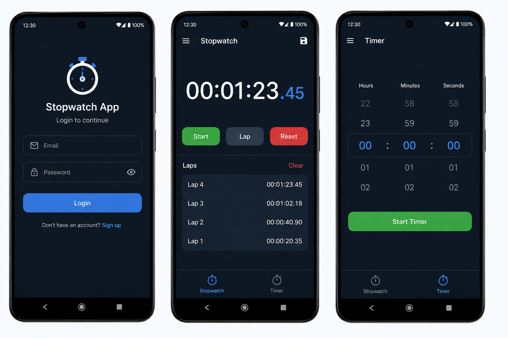

# Stopwatch & Timer Android App

A simple Android application built with Java that includes user authentication, stopwatch functionality, timer functionality, and lap tracking using Firebase.

## App Preview

<p align="center">
  
</p>

## Overview

This project is an Android mobile application designed to help users track time using a stopwatch and timer.  
The app includes login and signup functionality, and it stores lap records using Firebase Realtime Database.

## Features

- User login and signup
- Stopwatch with start, lap, and reset options
- Timer screen
- Lap records display
- Clear saved laps
- Firebase Authentication integration
- Firebase Realtime Database integration
- Clean and simple Android interface

## Technologies Used

- Java
- Android Studio
- XML Layouts
- Firebase Authentication
- Firebase Realtime Database
- Gradle

## Project Structure

```text
app/
 └── src/main/
     ├── java/com/example/stopwatchapp/
     ├── res/layout/
     └── AndroidManifest.xml
```

## How to Run

1. Clone the repository.
2. Open the project in Android Studio.
3. Wait for Gradle Sync to finish.
4. Make sure the Firebase configuration file exists:

```text
app/google-services.json
```

5. Run the app on an Android emulator or physical device.

## Purpose of the Project

This project was created to practice Android development, Firebase integration, user authentication, and basic mobile app UI design.

## Author

Waleed Alharbi
